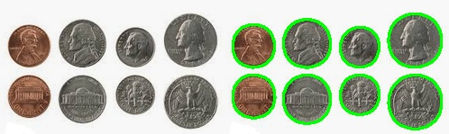
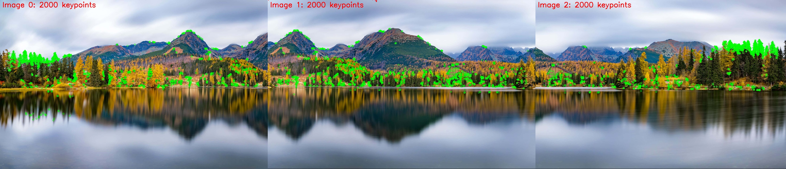
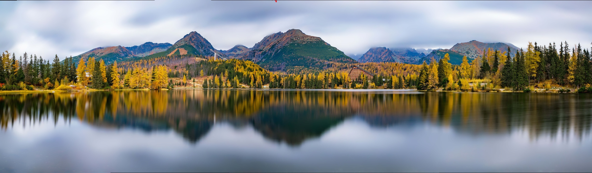

# VR Assignment 1

This repository contains two image processing projects: Coin Detection and Panorama Creation.

## Table of Contents
- [Dependencies](#dependencies)
- [Coin Detection](#coin-detection)
  - [Methods Used](#coin-detection-methods)
  - [Results and Observations](#coin-detection-results)
- [Panorama Creation](#panorama-creation)
  - [Methods Used](#panorama-methods)
  - [Results and Observations](#panorama-results)
- [How to Run](#how-to-run)

## Dependencies

To run the code in this repository, you'll need the following:

```
python >= 3.6
opencv-python
numpy
matplotlib
```

You can install the required packages using:

```bash
pip install opencv-python numpy matplotlib
```

## Coin Detection

### Coin Detection Methods

The coin detection algorithm uses the following techniques:

1. **Edge Detection**: Canny edge detection to identify the boundaries of coins
2. **Contour Detection**: Finding and filtering contours based on circularity and area
3. **Watershed Algorithm**: For segmentation, especially useful for separating touching or overlapping coins
4. **Morphological Operations**: Opening and dilation to clean up the image and prepare for segmentation

### Coin Detection Results

The coin detection algorithm successfully identifies circular objects and counts them accurately.



#### Observations:
- The algorithm is robust to varying coin sizes
- Minimum circularity and area thresholds help filter out non-coin objects
- Watershed segmentation effectively separates touching coins

## Panorama Creation

### Panorama Methods

The panorama creation algorithm employs:

1. **ORB Feature Detection**: Extracts keypoints from each image
2. **Feature Matching**: Identifies corresponding points between overlapping images
3. **OpenCV's Stitcher**: Uses the SCANS mode for more robust stitching
4. **Image Visualization**: Displays detected keypoints and the final panorama

### Panorama Results

The algorithm successfully creates panoramic images from a series of overlapping images.





#### Observations:
- Image resizing can help when stitching fails with full-sized images
- The quality of the panorama depends heavily on the number and quality of keypoints

## How to Run

### Coin Detection

```bash
python coin_detection.py
```

This will:
1. Load the coin image from `images_coin/coins.png`
2. Detect and outline all coins
3. Apply segmentation to separate individual coins
4. Display and save the result with the coin count

### Panorama Creation

```bash
python panaroma_creation.py
```

This will:
1. Load all images from the `images_pan/imgs` directory
2. Detect and display keypoints on each image
3. Stitch the images together to create a panorama
4. Display and save both the keypoints visualization and the final panorama

### Dataset Structure

The repository follows this structure:
```
.
├── coin_detection.py
├── panaroma_creation.py
├── images_coin/
|   ├── coin_detection_result.png
│   └── coins.png
├── images_pan/
├── keypoints_combined.jpg
├── panorama_result.jpg
│   └── imgs/
│       ├── image1.jpg
│       ├── image2.jpg
│       └── ...
```

