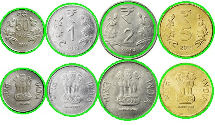
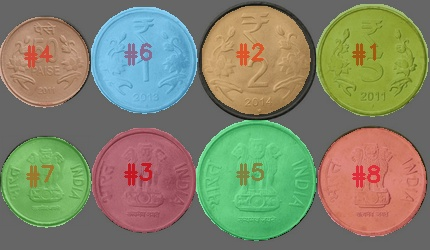
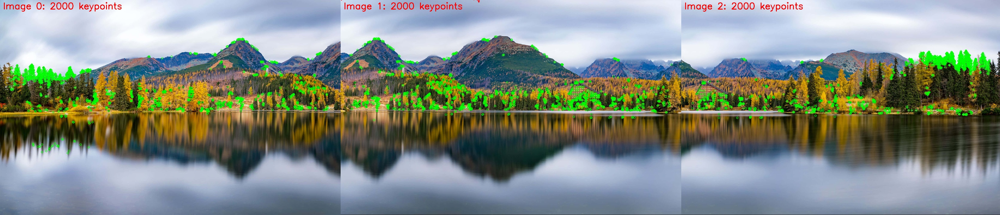

# VR Assignment 1: Coin Detection and Image Stitching

## Table of Contents
1. [Introduction](#introduction)
2. [Installation and Dependencies](#installation-and-dependencies)
3. [Running the Code](#running-the-code)
4. [Methods Used](#methods-used)
5. [Results and Observations](#results-and-observations)
6. [Output Images](#output-images)
7. [Repository Structure](#repository-structure)

## Introduction
This project involves two main tasks:
1. **Coin Detection and Segmentation**: Detecting, outlining, and counting coins in an image using edge detection and segmentation techniques.
2. **Image Stitching**: Aligning and stitching multiple overlapping images to create a panorama using feature detection and transformation techniques.

## Installation and Dependencies
Ensure you have Python installed along with the following dependencies:
```sh
pip install opencv-python numpy matplotlib argparse glob2
```

## Running the Code
### Coin Detection
To detect and segment coins from an image, run:
```sh
python coin_detection.py --input_path <path_to_coin_image> --output_path <output_directory>
```
Example:
```sh
python coin_detection.py --input_path images/coins.jpg --output_path results/
```

### Image Stitching
To create a panorama from multiple images, run:
```sh
python image_stitching.py --input_path <folder_with_images> --output_path <output_directory>
```
Example:
```sh
python image_stitching.py --input_path images/panorama/ --output_path results/
```

## Methods Used
### Coin Detection and Segmentation

#### 1. Edge Detection
- Hough Circle Transform (HCT) is used to detect circular objects (coins) in the image.
- HCT performs edge detection by computing image gradients using Sobel filters.
- Gaussian Blur is applied to reduce noise before detecting edges.
- HoughCircles detects circular patterns by accumulating votes for potential circle centers.
- Detection parameters (`minRadius`, `maxRadius`, `param1`, and `param2`) are scaled based on image size to ensure scale-invariant detection.

#### 2. Coin Segmentation
- A masking technique is used to isolate individual coins from the background.
- Contours are drawn around each detected circle, and a mask is applied to extract each coin.
- Segmented coins are saved as separate images for further analysis.

#### 3. Counting the Coins
- The total number of coins is determined by counting the number of detected circles.


### Image Stitching

#### 1. Feature Detection
- ORB (Oriented FAST and Rotated BRIEF) is used to detect key points in the input images.
- ORB is chosen for its efficiency and scale invariance, ensuring robust key point detection across different images.
- The detected key points are visualized on each image using `cv2.drawKeypoints` and then concatenated into a single image for comparison.
- The combined keypoints visualization is saved as `keypoints_combined.jpg`.

#### 2. Feature Matching
- Detected key points are matched between overlapping images using a descriptor matching algorithm.
- A ratio test is applied to filter out weak matches and retain only the most relevant correspondences.

#### 3. Image Stitching
- The images are stitched using OpenCV's built-in `Stitcher` in SCANS mode for improved robustness.
- The final panoramic image is generated by stitching together the aligned images.


## Results and Observations
- The **coin detection** method effectively detects and outlines coins.
- The **segmentation method** isolates each coin and correctly counts them.
- The **stitching algorithm** successfully creates a panorama if images have sufficient overlap and distinct features.

## Output Images
Output images are saved in the specified output directory and include:
- `coins_detected.jpg`: Coins outlined in the image.
- `coins_segmented.jpg`: Segmented coins with labels.
- `coin_X.jpg`: Individual cropped images of each coin.
- `keypoints_combined.jpg`: Visualization of detected keypoints for image stitching.
- `panorama_result.jpg`: The final stitched panoramic image.

### Sample Results
#### Coin Detection and Segmentation



#### Image Stitching



## Repository Structure
```
project_root/
├── coin_detection.py
├── images_coin
│   ├── coins.png
│   └── results
│       ├── coin_1.jpg
│       ├── coin_2.jpg
│       ├── coin_3.jpg
│       ├── coin_4.jpg
│       ├── coin_5.jpg
│       ├── coin_6.jpg
│       ├── coin_7.jpg
│       ├── coin_8.jpg
│       ├── coins_detected.jpg
│       └── coins_segmented.jpg
├── images_pan
│   ├── imgs
│   │   ├── 1.png
│   │   ├── 2.png
│   │   └── 3.png
│   └── results
│       ├── keypoints_combined.jpg
│       └── panorama_result.jpg
└── panaroma_creation.py

```
